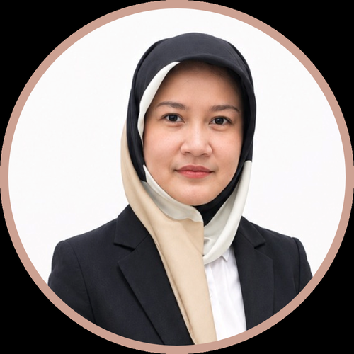

Our fellows are economists and researchers based outside DEN who collaborate
with the lab on specific projects. Each brings independent expertise to applied
work on the Indonesian economy.

::: {.fellows-grid}

::: {.fellow-card}
{.fellow-photo fig-alt="Photo of Adhi Nugroho Saputro"}

[Adhi Nugroho Saputro]{.fellow-name}

[PROSPERA — Australia Indonesia Partnership for Economic Development]{.fellow-affiliation}

[Expertise: rigorous quantitative methods, macro-financial analysis, growth diagnostics, and fiscal & tax policy.]{.fellow-bio}

::: {.fellow-project}
[Research at DEN]{.fellow-project-label}
[Financial Programming and Policies (FPP); Rupiah Plus Policy.]{.fellow-project-title}
[Placement]{.fellow-project-label}
[Bidang Percepatan Program Prioritas Ekonomi]{.fellow-project-title}
:::
:::

::: {.fellow-card}
{.fellow-photo fig-alt="Photo of Andhini Novrita Zurman Nasution"}

[Andhini Novrita Zurman Nasution]{.fellow-name}

[University of Edinburgh, School of Mathematics]{.fellow-affiliation}

[Expertise: computational fluid dynamics (CFD), fluid-structure interaction (FSI), machine learning, and high-performance computing.]{.fellow-bio}

::: {.fellow-project}
[Research at DEN]{.fellow-project-label}
[Climate modelling.]{.fellow-project-title}
[Placement]{.fellow-project-label}
[Sekretaris Eksekutif Dewan Ekonomi Nasional]{.fellow-project-title}
:::
:::

::: {.fellow-card}
{.fellow-photo fig-alt="Photo of Sufintri Rahayu"}

[Sufintri Rahayu]{.fellow-name}

[Nestlé, Bukalapak, Traveloka]{.fellow-affiliation}

[Expertise: reputation management, public & media relations, government relations & public policy, business sustainability & CSR, internal communications, and crisis management.]{.fellow-bio}

::: {.fellow-project}
[Research at DEN]{.fellow-project-label}
[DEN social media upgrading.]{.fellow-project-title}
[Placement]{.fellow-project-label}
[Sekretaris Eksekutif Dewan Ekonomi Nasional]{.fellow-project-title}
:::
:::

::: {.fellow-card}
{.fellow-photo fig-alt="Photo of Muhammad Halley Yudhistira"}

[Muhammad Halley Yudhistira]{.fellow-name}

[LPEM FEB UI]{.fellow-affiliation}

[Expertise: urban economics, transportation economics, and applied econometrics.]{.fellow-bio}

::: {.fellow-project}
[Research at DEN]{.fellow-project-label}
[Toll roads and nightlight data.]{.fellow-project-title}
[Placement]{.fellow-project-label}
[Bidang Percepatan Program Prioritas Ekonomi]{.fellow-project-title}
:::
:::

:::

## Become a fellow

We host external researchers working on Indonesian macroeconomics, trade, and
applied policy. If you would like to collaborate on a project with the lab, get
in touch:

- General inquiries: <krisna@dewanekonomi.go.id>
- GitHub: [github.com/den-econ](https://github.com/den-econ)
